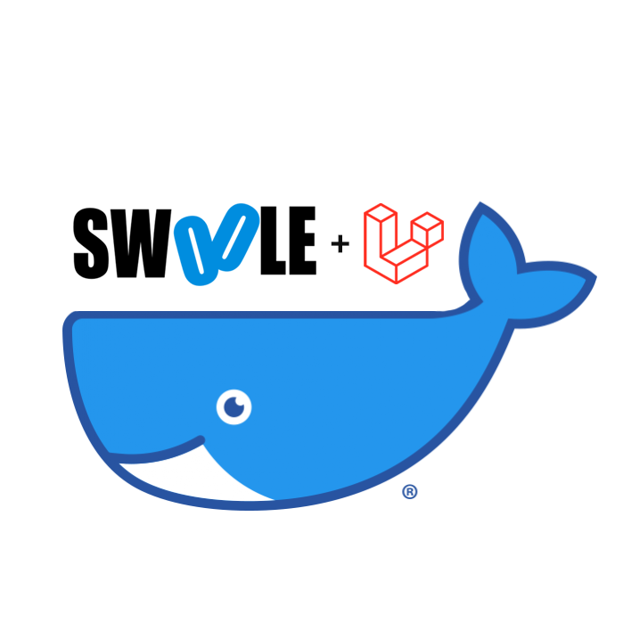

# Docker Swoole template for Laravel

<p align="center">
  
</p>

A Docker Compose workflow for start PHP scripts or Laravel project using Swoole without Laravel Octane and laravel Sail.

## Ports

Ports used in the project:
| Software | Port |
|-------------- | -------------- |
| **phpmyadmin** | 8083 |
| **mysql** | 3306 |
| **swoole** | 1215 |
| **redis** | 6379 |

## Usage

To get started, make sure you have [Docker installed](https://docs.docker.com/) on your system and [Docker Compose](https://docs.docker.com/compose/install/), and then clone this repository.

1. Go to something folder and clone this project:

   ```sh
   git clone https://github.com/ErriourRU/docker-swoole-for-laravel.git ./
   ```
2. Copy file .env.example to .env and change data to own

3. **Create** or **Put** your [laravel project](https://laravel.com) in the folder.

4. Install [laravel-swoole](https://github.com/swooletw/laravel-swoole) package and configure.
   
   ```
   composer require swooletw/laravel-swoole 
   ```
    
   You have to add following params to your laravel .env file:

   ```
   SWOOLE_HTTP_HOST=0.0.0.0
   SWOOLE_HTTP_WEBSOCKET=true
   ```

5. **Temporary problem**: laravel-swoole doesn't support OpenSwoole yet. To fix it, you should add this code to package manually: [Added openswoole extension check compatibility #506](https://github.com/swooletw/laravel-swoole/pull/506)

4. Build the project with the next commands:

   ```sh
   docker-compose up --build -d
   ```


## ENV configuration of Docker

The configuration of the database **must be the same on both sides** .

```dotenv
# .env
DB_CONNECTION=mysql
DB_HOST=127.0.0.1
DB_PORT=3306
DB_DATABASE=db_name
DB_USERNAME=db_user
DB_PASSWORD=db_password
DB_ROOT_PASSWORD=secret
```

```dotenv
# src/.env
DB_CONNECTION=mysql
DB_HOST=mysql
DB_PORT=3306
DB_DATABASE=db_name
DB_USERNAME=db_user
DB_PASSWORD=db_password
```

The only change is the `DB_HOST` in the `src/.env` where is called to the container of `mysql`:

```dotenv
# src/.env
DB_HOST=mysql
```
